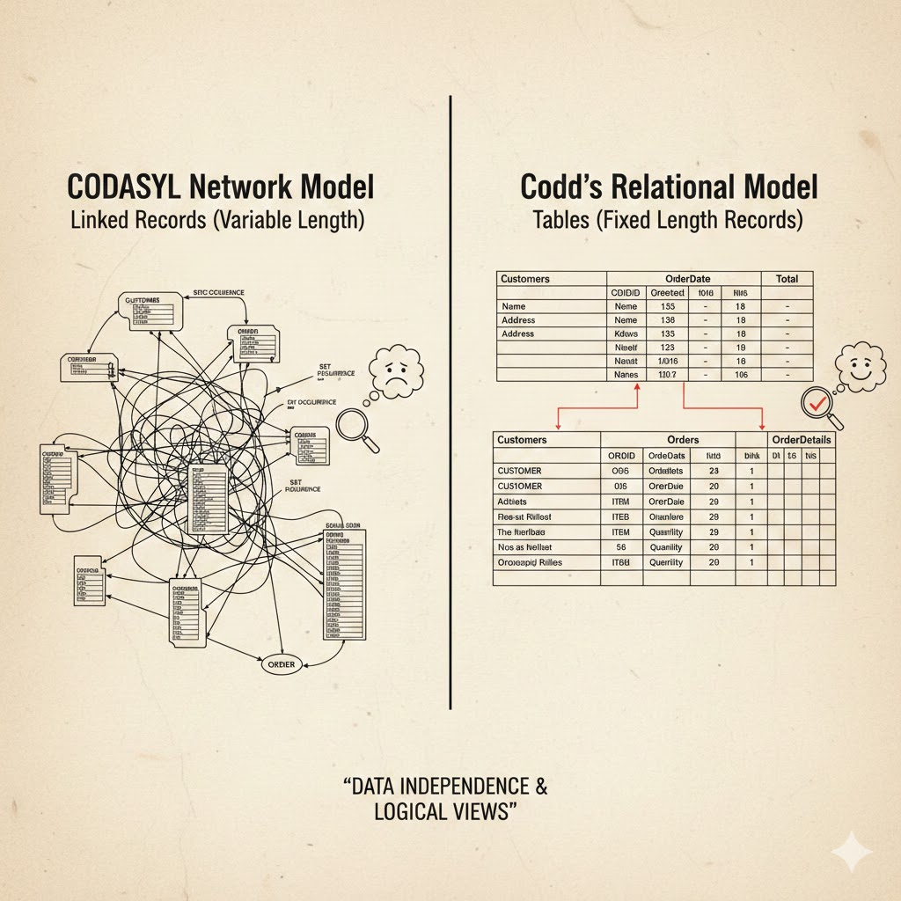

# História dos Bancos de Dados

## Antes do nascimento do Banco de Dados
Antes mesmo do conceito de banco de dados como conhecemos hoje, para que fosse possível armazenar informações, incluir dados e até programas em computadores, eram utilizados os *cartões perfurados*
<br>

Os cartões perfurados são considerados a primeira mídia legível por máquina usada para coleta de dados, utilizados para incluir dados e comandos nas máquinas. <br>Os dados eram codificados pela posição vertical dos furos: cada coluna representava um caractere, onde a combinação de furos em diferentes linhas era interpretada pelo **Código Hollerith**. Assim, em vez de bits eletrônicos, a máquina identificava a presença ou ausência de furos para processar informações e comandos.
<br>

 Inicialmente, computadores eram basicamente calculadores gigantes, ou seja, o sucesso na concepção de um computador seria sua capacidade de solucionar fórmulas matemáticas, tanto que, neste período, os dados eram considerados resquícios de processamento de informações. 
 <br>Em suma, os dados eram somente meio para se chegar em um resultado, como a entrada e saída de um cálculo, esses dados não eram armazenados pela máquina, eles simplesmente "sumiam", tal qual uma calculadora. Porém, com a revolução dos computadores, na qual os mesmo passaram a se tornar comercialmente disponíveis, inclusive sendo utilizados no meio corporativo e comercial, esses dados residuais, anteriormente irrelevantes, se tornaram repentinamente importantes.
 <br>

---

## O surgimento do Banco de Dados 
 A história do surgimento e crescimento do banco de dados ocorre paralelamente com a evolução hardware, em relação às mídias físicas de armazenamento, pois com o surgimento de mídias físicas cada vez mais potentes e com maior capacidade, foi tornando-se possível armazenar informações sem necessidade de mídias externas (cartões perfurados), já que o armazenamento estava internamente contido na máquina. O ponto de virada ocorreu em  1956, quando a **IBM** lançou o primeiro computador com um disco rídigo integrado, permitindo que agora houvesse acesso direto ao dados desejados, sem necessitar ler toda uma sequência de dados, como ocorria pouco anos antes, quando utilizava-se a **fita magnética** para armazenamento sequencial dos dados. Essa evolução permitiu o surgimento aos primeiros modelos de Banco de Dados: **O modelo Hierárquico** e o **modelo de Rede (**CODASYL**).**
<br>

---
#### Modelo Hierárquico 

##### Conceito 
Trata-se de um modelo de dados no qual os dados são organizados em uma estrutura semelhante a uma árvore. O modelo de banco de dados hierárquico exige que cada registro filho tenha apenas um pai, enquanto cada registro pai pode ter zero ou mais registros filhos

---

##### Representação Visual 


##### Concepção 

1. Os dados são armazenados como **registros**, que são coleções de um ou mais **campos**
2. Cada campo contendo um único valor, e o conjunto de campos em um registro define seu **tipo**
3. Um tipo de campo é o **link**, que conecta um determinado registro a registros associados
4. Usando os **links**, os registros se conectam a outros registros, e assim por diante, formando uma árvore
5. Por exemplo é um registro de *cliente* que possui *links* para os *pedidos* desse cliente, que por sua vez se conectam aos *itens_da_linha*

--- 

#### Modelo de Rede 

##### Conceito 

Em meados da década de 1960, com o desenvolvimento de computadores em termos de velocidade e flexibilidade, e sua popularização, diversos tipos de sistemas de banco de dados de uso geral tornaram-se disponíveis. Como resultado, os clientes exigiram o desenvolvimento de um padrão, o que levou Charles W. Bachman, considerado o projetor do "primeiro" SGBD, a formar o **Database Task Group**. Esse grupo assumiu a responsabilidade pelo projeto e padronização de uma linguagem chamada `Common Business Oriented Language ( COBOL )`. O Database Task Group apresentou esse padrão em 1971, que também ficou conhecido como a “abordagem CODASYL”.

--- 

###### `COBOL`

> Basicamente, é uma linguagem de programação orientada para o processamento de banco de dados comerciais. O COBOL foi projetado com a versatilidade ideal em mente, pois sua verbosidade permite que os programadores usem uma linguagem de programação legível e fácil de manter, que pode funcionar em computadores e sistemas operacionais mainframe. Embora considerada uma linguagem legada, o COBOL é extremamente estável e estratégico, suportando a grande maioria das transações de cartões de crédito e sistemas bancários globais hoje.<br>
A robustez do COBOL na automação de processos o torna ideal para trabalhos de processamento em lote, como o processamento de transações financeiras, o gerenciamento de bancos de dados e a geração de relatórios.

* Exemplo de Código em COBOL (Foco na verbosidade)
     ```cobol
     IF SALARIO > 5000
     DISPLAY "SALÁRIO ALTO"
     ELSE
     DISPLAY "SALÁRIO NORMAL"
     END-IF.
     ```

---

Enquanto o modelo de banco de dados hierárquico estrutura os dados como uma árvore de registros, cada registro tendo um registro pai e vários filhos, o modelo de rede permite que cada registro tenha múltiplos registros pai e filho, formando uma estrutura de grafo generalizada. 
<br>
Dependia de uma técnica de navegação “manual” utilizando um conjunto de dados interligados, que formavam uma grande rede. A busca por registros podia ser realizada por uma das três técnicas:

* Utilizando a chave primária (também conhecida como chave CALC)
* Transferindo relações (também chamadas de conjuntos) de um registro para outro
* Analisando todos os registros em ordem sequencial.


##### Representação Visual 


#### Modelo Hierárquico x Modelo em Redes

O principal argumento a favor do modelo de rede, em comparação com o modelo hierárquico, era que ele permitia uma modelagem mais natural das relações entre as entidades. **Embora** o modelo tenha sido amplamente implementado e utilizado, ele não se tornou dominante por dois motivos principais : 
<br>

1. A IBM optou por manter o modelo hierárquico com extensões semi-rede em seus produtos consolidados, como o IMS e o DL/I;
2. Ele acabou sendo substituído pelo `modelo relacional`, que oferecia uma interface de nível superior e mais declarativa

---

### Banco de Dados como conhecemos hoje (ou quase)

--- 
#### O surgimento do Modelo Relacional 

Motivado por sua insatisfação na falta de um mecanismo de busca na abordagem CODASYL/Modelo de Rede, **Edgar Codd** escreveu uma série de artigos, em meados de 1970, delineando novas maneiras de construir bancos de dados. <br> Suas ideias eventualmente evoluíram para um artigo rotulado "*Um Modelo Relacional de Dados para Grandes Bancos de Dados Compartilhados*", que descrevia um novo método para armazenar dados e processar grandes bancos de dados. <br> Por meio destes artigos, foi trazida uma nova revolução, o que antes se tratava de um modelo com os registros armazenados em uma lista com registros encadeados de formato livre, como no modelo CODASYL, deu lugar a registro armazenados e organizados em uma "tabela com registros de comprimento fixo", ou seja, armazenamento de dados em tabelas, bem semelhante ao que utilizamos no **Excel**, por exemplo. 



A IBM acabou não comprando as ideias de **Codd**, mas, felizmente, houveram pessoas que ficaram bastante interessadas na sua proposta. <br> Em 1973, Michael Stonebraker e Eugene Wong decidiram pesquisar sistemas de banco de dados relacionais. O projeto foi chamado de INGRES ( Sistema Interativo de Gráficos e Recuperação ) e demonstrou com sucesso que um modelo relacional poderia ser eficiente e prático. <br> O INGRES funcionava com uma linguagem de consulta conhecida como QUEL, o que, por sua vez, pressionou a IBM a desenvolver o SQL em 1974, que era mais avançado (o SQL tornou-se padrão ANSI e OSI em 1986 e 1987). O SQL rapidamente substituiu o QUEL como a linguagem de consulta mais funcional.

--- 

#### Armazenamento em Coluna

Um SGBD que utiliza colunas é bastante diferente dos sistemas de banco de dados relacionais tradicionais. <br> Ele armazena dados como porções de colunas, em vez de linhas. Essa mudança de foco, de linhas para colunas, permite que os bancos de dados colunares maximizem seu desempenho quando grandes quantidades de dados são armazenadas em uma única coluna. Essa vantagem pode ser estendida a data warehouses e aplicações de CRM (Gestão de Relacionamento com o Cliente)


* Vantagens de um Banco de Dados Colunas : 
1. Compactação de dados :  A compactação avançada de dados reduz a quantidade de requisitos de armazenamento, o que também exige menos tempo de busca para encontrar os dados no disco, pois é possível ter conhecimento que cada coluna possuí um tipo de dados (como ilustrado na figura acima). E qquanto mais rápidos os tempos de busca e os upgrades de desempenho, mais rápido são os cálculos comuns (por exemplo, MIN ou SUM);
2. Autoindexação: Os administradores usados para indexar manualmente os bancos de dados tradicionais apreciarão a capacidade de autoíndice do banco de dados em colunas, o que também reduz a quantidade de espaço de armazenamento necessário para os dados;
3. Eliminação do NULL: Em vez de armazenar valores NULL, o que ocupa espaço de armazenamento, os bancos de dados em colunas não armazenam valores NULL ou ausentes;

---

#### NoSQL

O **NoSQL** (**“Not only” Structured Query Language**) surgiu como resposta à internet e à necessidade de maior velocidade e processamento de dados não estruturados. <br> De modo geral, os bancos de dados NoSQL são preferíveis aos bancos de dados relacionais em certos casos de uso devido à sua velocidade e flexibilidade. <br> 
> **Dados não estruturados** : São dados que **não** possuem um formato predefinido ou uma organização rígida, tratam-se de dados não estruturados não se encaixam perfeitamente em uma tabela de dados devido ao seu tamanho ou natureza. Se o sistema consegue ler em um tabela os campos e nomes das colunas e compreender do que se trata, já com os dados estruturados, isso não é possível, pois se trata de um amontoado de pixels, então não é possui legibilidade direta da informação para o sistema

O modelo NoSQL é não relacional e utiliza um sistema de banco de dados “distribuído”. Esse sistema não relacional é rápido, utiliza um método *ad-hoc* de organização de dados e processa grandes volumes de diferentes tipos de dados, ou seja, não necessita de uma estrutura rígida ou um esquema (*schema*) pré-definido. <br>Por exemplo, se um registro de "Cliente" hoje tem apenas nome e e-mail, mas amanhã você precisa salvar a latitude e longitude, você simplesmente insere esses campos no novo registro sem afetar os anteriores ou "pedir permissão" ao banco.
<br>
O uso generalizado do NoSQL pode ser atribuído aos serviços oferecidos por empresas como Twitter, LinkedIn, Facebook e Google. Cada uma dessas organizações armazena e processa quantidades colossais de dados não estruturados.
<br> O uso generalizado do NoSQL pode ser atribuído aos serviços oferecidos por empresas como Twitter, LinkedIn, Facebook e Google. Cada uma dessas organizações armazena e processa quantidades colossais de dados não estruturados.


